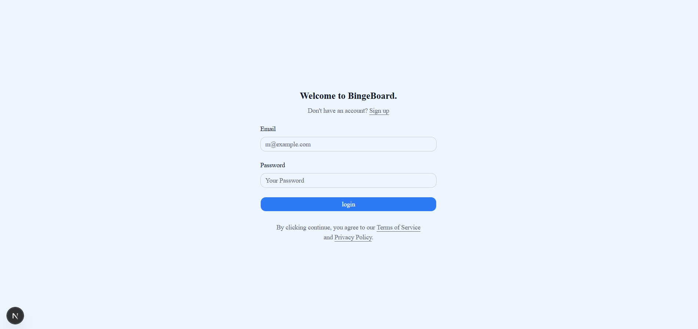
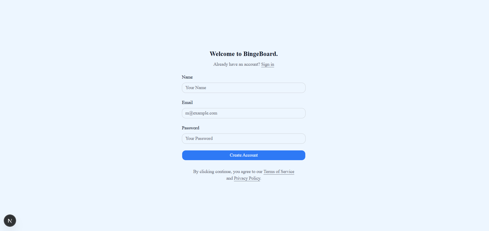
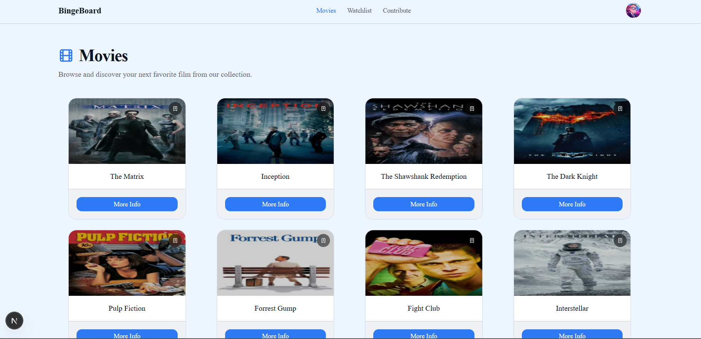
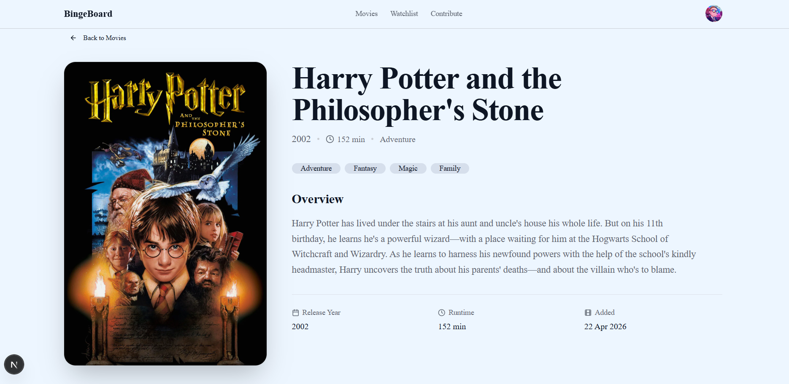
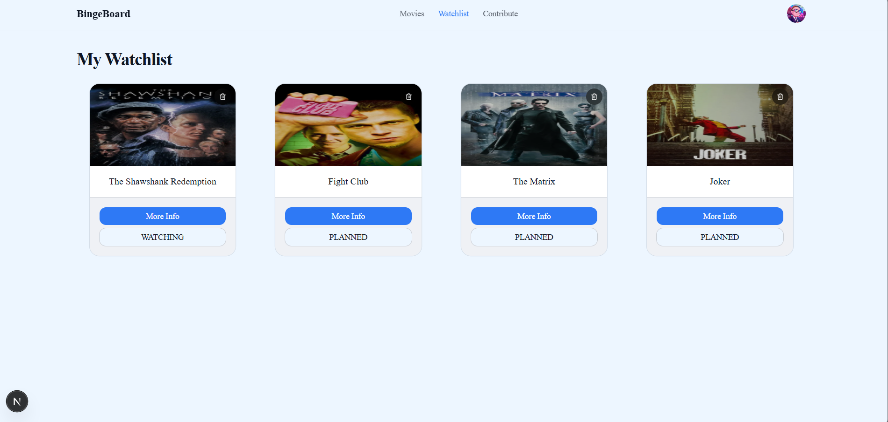
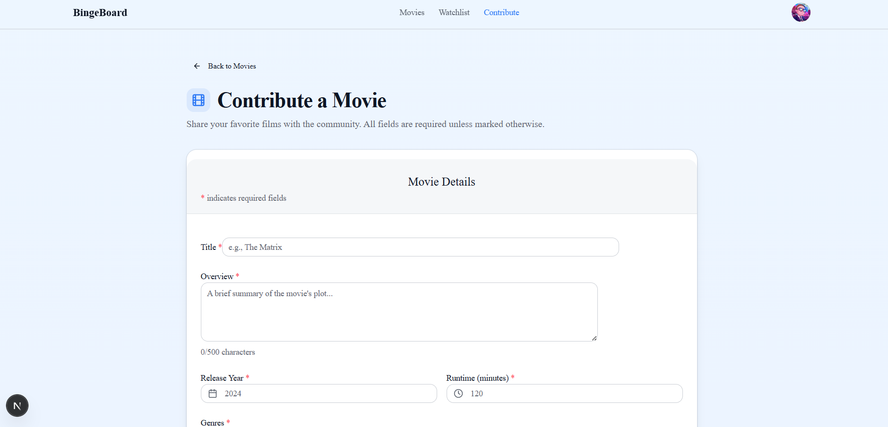

# Movie Watchlist Frontend

A modern, responsive web application that allows users to browse movies and manage their personal watchlists. Built with Next.js App Router, Tailwind CSS, and Shadcn UI.

## 📸 Screenshots

<p align="center">
  
  
</p>

<p align="center">
  
</p>

<p align="center">
  
</p>

<p align="center">
  
</p>

<p align="center">
  
</p>

## 🚀 Features

- **Authentication System**: Secure login and signup flows with token validation.
- **Protected Routes**: Middleware-based route protection to ensure only authenticated users can access their watchlists.
- **Movie Browsing**: View and discover movies.
- **Watchlist Management**:
  - Add movies to your personal watchlist.
  - View your watchlist.
  - Update and edit watchlist entries.
  - Remove items from your watchlist.
- **Modern UI/UX**:
  - Fully responsive design.
  - Accessible components using Radix UI and Shadcn UI.
  - Interactive elements like dropdowns and modal forms.

## 🛠️ Tech Stack

- **Framework**: [Next.js 16](https://nextjs.org/) (App Router)
- **Library**: [React 19](https://react.dev/)
- **Styling**: [Tailwind CSS v4](https://tailwindcss.com/)
- **UI Components**: [Shadcn UI](https://ui.shadcn.com/) & [Radix UI](https://www.radix-ui.com/)
- **State Management & Data Fetching**: [TanStack React Query](https://tanstack.com/query/latest)
- **Form Handling & Validation**: [React Hook Form](https://react-hook-form.com/) & [Zod](https://zod.dev/)
- **Icons**: [Lucide React](https://lucide.dev/)
- **Language**: TypeScript

## 📂 Project Structure

```text
├── app/                  # Next.js App Router (pages, layouts, routing)
│   ├── (auth)/           # Authentication pages (Login, Signup)
│   ├── movies/           # Movie browsing pages
│   ├── profile/          # User profile management
│   └── watchlist/        # Watchlist management pages
├── components/           # Reusable UI components
│   └── ui/               # Base Shadcn UI components
├── hooks/                # Custom React hooks
├── lib/                  # Utility functions
├── providers/            # Context providers (e.g., React Query Provider)
├── services/             # API integration and data fetching services
└── types/                # TypeScript type definitions
```

## 🏁 Getting Started

### Prerequisites

- Node.js (v20 or higher recommended)
- npm, yarn, pnpm, or bun

### Installation

1. Clone the repository and navigate to the project folder:
   ```bash
   cd movie-watchlist
   ```

2. Install dependencies:
   ```bash
   npm install
   # or
   yarn install
   # or
   pnpm install
   ```

3. Start the development server:
   ```bash
   npm run dev
   ```

4. Open [http://localhost:3000](http://localhost:3000) with your browser to see the application running.

## 📝 Roadmap / TODO

### This project has now been temporarily freezed since it has all core functionalities needed

- [x] Write middleware-based protected routes
- [x] Implement Logout through navbar avatar dropdown
- [x] Implement Add to Watchlist functionality
- [x] Implement Watchlist Page (read, edit, delete)
- [x] Implement Movies / Movie Detail page
- [x] Special root '/' route handling and protecting navbar on public routes
- [ ] Implement Contribute Page (~~allow adding~~, editing, and deleting titles) (partially done)
- [ ] Complete Profile Page
- [ ] Add token validation check on proxy/middleware to prevent users with expired tokens from accessing protected routes

## 🤝 Contributing

Contributions, issues, and feature requests are welcome! Feel free to check the issues page if you want to contribute.
